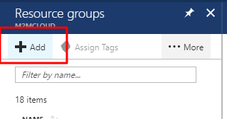
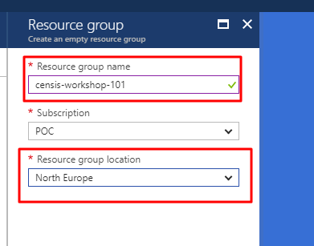

# IoT Hub - Hands On Lab

## Contents

1. [Objectives and Requirements](#objectives-and-requirements)
    1. [Objectives](#objectives)
    1. [Requirements](#requirements)
1. [Instructions](#instructions)
   1. [Prerequisites](#prerequisites)
   1. [Create a Resource Group](#create-a-resource-group)
   1. [Create a Storage Account](#create-a-general-purpose-storage-account)
   1. [Create an Azure IoT Hub](#create-an-azure-iot-hub)
   1. [Use Azure IoT Hub to manage a IoT Asset](#use-azure-iot-hub-to-manage-a-iot-asset)
   1. [Send Device Messages to the IoT Hub](#send-device-messages-to-the-iot-hub)
   1. [Send a large Device Message file to the IoT Hub](#send-a-large-device-messages-file-to-the-iot-hub)
   1. [Read Device Twin Properties](#read-device-twin-properties)
   1. [Write Device Twin Properties](#write-device-twin-reported-properties)
   1. [Receive Cloud to Device Message](#receive-cloud-to-device-message)
   1. [Invoke Device Direct Method](#invoke-device-direct-method)
   

## Objectives and Requirements

### Objectives
1. Create Azure Resource Group
1. Create an [Azure IoT Hub](https://azure.microsoft.com/en-gb/services/iot-hub/) 
1. Use [Azure IoT Hub](https://azure.microsoft.com/en-gb/services/iot-hub/) to manage a simulated IoT Device
1. Send Device Message(s) to an [Azure IoT Hub](https://azure.microsoft.com/en-gb/services/iot-hub/) 
1. Send a large Device Message file to an [Azure IoT Hub](https://azure.microsoft.com/en-gb/services/iot-hub/) 
1. Read and Write [Device Twin](https://docs.microsoft.com/en-us/azure/iot-hub/iot-hub-devguide-device-twins) Properties
1. Receive a message from the [Azure IoT Hub](https://azure.microsoft.com/en-gb/services/iot-hub/) 
    1. Cloud to Device Messages
    1. Direct Method on Device invocation
   

### Requirements

1. Microsoft Visual Studio Community, Professional or Enterprise 2017 (Windows 10)

1. Access to an Azure Subscription with Administrator permissions

---

## Instructions

### Prerequisites

Activities in this lab take place within the Azure Portal and Visual Studio 2017. 

### Create a Resource Group

We're going to create a resource group that allows us to logically group related Azure resources. Once we finished both Hands On Lab 1 (HOL1) and Hands On Lab 2 (HOL2) then you can delete the Resource Group, which will delete all Azure Resources associated with the Resource Group. 

1. Navigate to the [Azure Portal](https://portal.azure.com)

1. Select "Resource Groups" from the menu on the left
    
1. Click the Add button  

    
   
1. Name the Resource Group `censis-workshop`

    

1. Click the Create button to Create your new Resource Group

    

1. Navigate to your newly created Resource Group, "censis-workshop" by clicking on the "Go to resource group button". You can also navigate to the your new Resource Group by clicking on "Resource Groups" in the main navigation menu on the left. 

### Create a General Purpose Storage Account

We need to create a storage account which will be used to store blob and table data.

1. In the `censis-workshop` Resource Group blade, select add in the top left

   
1. In the search box type "Storage Account" and select `Storage Account - blob, file, table, queue`

   
1. Select `Storage Account - blob, file, table, queue` from the results and click `Create`

   
1. In the `Create Storage Account` Blade, give your storage account a name. The name must be globally unique, 24 characters or fewer and contain only alpha-numeric characters. Configure the storage account settings as follows and click `Create`:

   

We won't be using the storage account until later. When the deployment succeeds, you don't need to go to the resource immediately. You can move straight on to the next section


### Create an Azure IoT Hub

We'e going to create an Azure IoT Hub that will allow us to manage and communiate with a simulated IoT Device. 

1. Navigate to your Resource Group, "censis-workshop" if you have not done so already.
    
1. Click the Add button to add a new resource to your Resource Group

    

1. In the search box type `iot hub` and select the IoT Hub resource that appears in the results list then click, "Create"

    
    
1. Give the IoT Hub a globablly unique name, e.g. `censis-workshop-somethingunique`

    

1. Click "Pricing and scale tier and select the "Free" pricing tier

1. Double check... Make sure you have selected "Pricing and scale tier" is on the "Free" tier : ) 

1. In "Resource Group" select "Use existing" and select the existing `censis-workshop` resource group

1. In "Location" select "North Europe"

1. Click the "Create" button to create a new IoT Hub. The creation of this resource may take a few minutes. 

1. Navigate to the the newly created IoT Hub either by clicking on the notification that appears (or by using the "Search resources, services and docs" text box at the very top of the page and typing in the name of your IoT Hub)

### Use Azure IoT Hub to manage a IoT Asset

We need to register a Device with the newly created IoT Hub to authorise Device connect and message requests. 

1. Navigate to the newly create IoT Hub ("Resource Groups -> "censis-workshop" -> "name of your iot hub")
    
1. Click on "Device Explorer" on the left hand side menu

1. Click on "Add Device" 

    

1. Give the Device a unique identifier that will allow the IoT Hub to identify this Device. Copy the Device unique identifier and paste the string value into Notepad - we'll use this value in a moment. 

1. Click on "Save" to create the Device

    
   
1. Select the newly created Device by clicking on the Device in the Device Explorer list and view it's Device Details. 

    

    
1. Copy the Device specific Connection String and paste the string into Notepad or another text editor - we'll use this value in a moment.

    

1. Associate a storage account container with IoT Hub by clicking on "File Upload" on the left hand side menu
    
    
    
1. Select the previously created Storage Account, "censisworkshop" and create a new container within that Storage Account named "fileupload".
    
    
    
1. Select the newly created container and click "Save"

    

1. We're now ready to start messing around with the IoT Hub. 

### Send Device Messages to the IoT Hub
Now we're going to send some Device Messages to the IoT Hub.

1. Clone or download and unzip the [AzureIotWorkshop code repository](https://github.com/M2MCloud/AzureIotWorkshop) 

1. Open Visual Studio 2017 and open the solution `"HOL1\M2MCloud.Workshops.Azure.IoT.sln"`

1. Find the line below the comment 
    
```cs
//attendee to change #1
```

and set the `DeviceConnectionString` value to the Device Connection String we previously pasted into Notepad.

1. Find the line below the comment :

```cs
//attendee to change #2
``` 

and set the `deviceId` value to the Device unique identfifier we previously pasted into Notepad. The `DeviceId` string value you see in the `DeviceConnectionString` value should match the `deviceId` value you have just set. 

2. Optional - Find the line below the comment 

```cs 
//attendee to change #3 (optional)
``` 

The JSON string value in this line represents the Device message payload that will be sent to the IoT Hub. If you want, you can add / replace keys to this this JSON message so that it contains key values that represent assets in your own domain. 

For the purposes of this workshop, it's definately worth keeping the JSON structure relatively simple - try using a JSON number value and a JSON boolean value to represent a sensor sample from your own domain, e.g.

```json
{
	"deviceId":"000356865805524",
	"messageId":0,
	"speed":30.5,
	"ignition":true, 
}
```

or

```json
{
	"deviceId":"000356865805524",
	"messageId":0,
	"coffeeVolumeRemaining":1.8,
	"panicWarning":true, 
}
```

Change the random number generation as required. 

1. Run the Device simulator from Visual Studio (Debug->Start without Debugging or Cntrl + F5 )

1. Choose option "1" from the Device menu, "Send Device to Cloud Message(s)"

1. Choose a number of messages to send to the Hub...and send!

1. You should see the JSON messages that have been sent appear in the console app output. 
    
1. If you jump back into the Azure portal you and refresh the Device Details blade, you should see your IoT Usage values change - this sometimes takes a few moments to update!

    

### Send a large Device Message file to the IoT Hub

We're going to send a large Device message file to the IoT Hub. 

1. If it's not already, run the Device simulator (Debug -> Start without Debugging, or Cntrl + F5 )

1. Choose option "2" from the Device menu, "Send large Device Message file"

1. Grab a full file path that points to a local, non-sensitive file and paste the value when prompted. 

Let's have a look at the file the Device just uploaded:

1. Jump back into the Azure Portal into the `censis-workshop` Resource Group. 

1. Choose the storage account you created earlier in the lab. 
    
1. Navigate to the `fileupload` container

    

1. Navigate to the `fileupload` container

    
    
1. Navigate to the blob and you will see the file that was just uploaded.
    

### Read Device Twin Properties
We're going to have a look at the desired and reported Device Twin properties to demonstrate how they can be used to configure a Device and receive state from a Device. 

1. If it's not already, run the Device simulator (Debug->Start without Debugging or Cntrl + F5 )

1. Choose option "3" from the Device menu, "Read Device Twin Properties"

1. Have a look at the Device Twin properties. Not very interesting at this point - but notice worth noticing the presence of both Desired and Reported Device Twin JSON structures. 

### Write Device Twin Reported Properties
Lets make this Device Twins a bit more interesting by adding a Desired state value.

1. If it's not already, run the Device simulator (Debug->Start without Debugging or Cntrl + F5 )

1. Choose option "4" from the Device menu, "Write Device Twin Reported Properties"

1. Enter a name for the new reported property , e,g. ```CellId``` Feel free to choose some reported Device property from your own domain. 

1. Enter a value for the new reported property, e,g. ```234-015-974-6065```. 

1. Go back to the main menu and [Read Device Twin Properties](#read-device-twin-properties) again - you should see the value you just entered in the Device Reported Properties. 

1. Jump back into the IoT Hub resource in the Azure portal

1. Select the Query Explorer menu item on the left hand side. 

    
1. Paste in the following query to the Query Explorer, amended if you have modified the Key / Value values in the above steps:

    

    ```sql
    SELECT * FROM devices WHERE properties.reported.CellId = '234-015-974-6065'
    ```

1. Execute the query - you should be able to see your Device in the results set. 

### Receive Cloud to Device Message
We're going to send a message to the Device from the Backend Service. 

1. Jump into the IoT Hub in the Azure portal

1. Navigate to the your Device Details using the Device Explorer in the Azure Portal
    
1. Click the Message to Device button 

    

1. Add a message body in the text box e.g.

    ```json
    { "SendInterval": 10 }
    ```

and click the "Send Message" button

    

1. Jump back into Visual Studio 

1. If it's not already, run the Device simulator (Debug->Start without Debugging or Cntrl + F5 )

1. Choose option "5" from the Device menu, "Receive Cloud to Device Message"

1. You should see your Message to Device body appear in the Device Simulator console app

1. Leave the console app running as it is and send some more messages as described in the above step. 

1. If you like, you can jump back into the Azure Portal in the Message to Device blade and add message properties and click the "Send Message" button - the message properties should be emitted in the running Device Simulator console app. 

### Invoke Device Direct Method

We're going to invoke a method on the connected Device directly from the Azure portal to demonstrate how an immediate action can be performed on a connected Device. 

1. Run the Device simulator console app or return to the main menu if it's already running.

1. *Important* The app is currently listening for a Direct Method invocation, so there is no need to select a menu item. The console app has to be running the main menu for the next few steps to work. 

1. Jump into the IoT Hub in the Azure portal and navigate to your Device detail using the Device explorer
    
1. Click on the Direct Method button

    

1. Type in "stop" or "start" into the "method name" text box

    

1. Click "Invoke Method" button. Two things should happen:
    1. The Device Simulator console app should display a stop or start message
    1. The Result text box in the Azure Portal Direct Method blade (hightlighted in red above ^) should contain a result confirmation message from the Device

1. Repeat the above steps but this time add a JSON payload as a "Payload" parameter (make sure it's valid JSON or the Device Simulator app will wig out) and you should see the payload appear in the Device Simulator. 

[END OF LAB 1]


