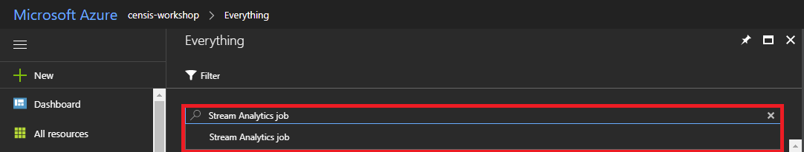
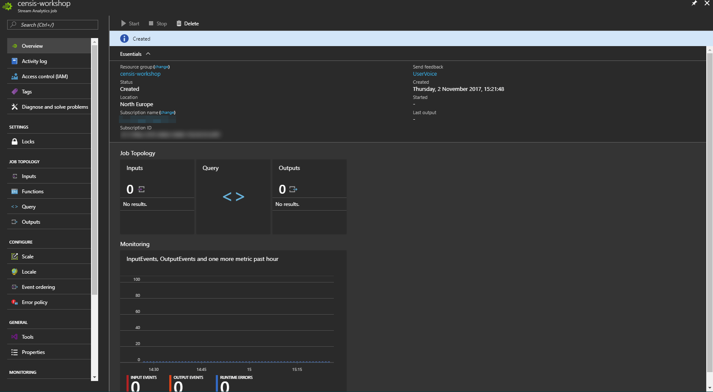

# Processing IoT Data - Hands On Lab

## Contents

1. [Objectives and Requirements](#objectives-and-requirements)
    1. [Objectives](#objectives)
    1. [Requirements](#requirements)
1. [Instructions](#instructions)
   1. [Prerequisites](#prerequisites)
   1. [Create a Storage Account](#create-a-general-purpose-storage-account)
   1. [Create a Stream Analytics Job](#create-an-azure-stream-analytics-job)
   1. [Create The Job Input](#create-the-job-input)
   1. [Add The Archive Output](#add-the-archive-output)
   1. [Add A Query](#add-a-query)
   1. [Create a CosmosDB Account](#create-a-cosmosdb-account)
   1. [Add The Aggregated Data Output](#add-the-aggregated-data-output)
   1. [Amend The Query to Include Aggregated Data](#amend-the-query-for-aggregated-data-output)

## Objectives and Requirements

### Objectives

1. Use [Azure Stream Analytics](https://azure.microsoft.com/en-gb/services/stream-analytics/) to process data from Azure IoT Hub
1. Output processed data from Stream Analytics to:
   1. [Azure Table Storage](https://azure.microsoft.com/en-gb/services/storage/tables/)
   1. [Azure CosmosDB](https://azure.microsoft.com/en-gb/services/cosmos-db/)
   1. Create an [Azure Logic App](https://azure.microsoft.com/en-gb/services/logic-apps/) to send alerts

### Requirements

1. Microsoft Visual Studio Community, Professional or Enterprise 2017 (Windows 10)
1. Access to an Azure Subscription with Administrator permissions
1. Azure Resource Group with an Azure IoT Hub (provisioned in the previous HOL)

---

## Instructions

### Prerequisites

Activities in this lab take place within the Azure Portal using the resource group created in the previous lab.

1. Navigate to the [Azure Portal](https://portal.azure.com)
1. Select "Resource Groups" from the menu on the left

   
1. Select the `censis-workshop` resource group you created in the previous Hands On Lab

### Create a General Purpose Storage Account

We need to create a storage account which will be used to store blob and table data.

1. In the `censis-workshop` Resource Group blade, select add in the top left

   
1. In the search box type "Storage Account" and select `Storage Account - blob, file, table, queue`

   
1. Select `Storage Account - blob, file, table, queue` from the results and click `Create`

   
1. In the `Create Storage Account` Blade, give your storage account a name. The name must be globally unique, 24 characters or fewer and contain only alpha-numeric characters. Configure the storage account settings as follows and click `Create`:
   

We won't be using the storage account until later. When the deployment succeeds, you don't need to go to the resource immediately. You can move straight on to the next section

### Create an Azure Stream Analytics Job

We will create an Azure Stream Analytics Job which will be used to perform aggregations on the data as well as storing data in an archive.

1. In the `censis-workshop` Resource Group blade, select add in the top left

   
1. In the search box type "Azure Stream Analytics" and select the suggestion

   
1. Select `Stream Analytics job` from the results and click `Create`

   
1. In the `New Stream Analytics job` blade, fill in the values as follows (selecting your subscription where relevant) and click `Create`:

   
1. When the deployment completes, select `Go to resource` in the notification

   

You should now see the following:


### Create The Job Input

The streaming job will take input from the IoT Hub created in the previous lab.

1. Under `Job Topology` select `Inputs`

   
1. In the inputs blade, select Add and populate the fields as follows and click `Create`

   
1. Click the cross in the input blade to go back to the streaming job overview

### Add The Archive output

The first output will be for an archive of raw data received from the device.

1. Under `Job Topology` select `Outputs`

   
1. In the Outputs Blade, select Add and populate the fields as follows and click `Create`

   
   1. Ensure you select the storage account created in the earlier step
   1. The Partition Key is `deviceId` and the Row Key is `EventEnqueuedUtcTime`
1. Click the cross in the output blade to go back to the streaming job overview

### Add A Query

1. Under `Job Topology` select `Query`

   
1. You should see the following Query Blade:

   
1. Replace the Query Text with the following and click `Save` confirming the changes when prompted:
   ```sql
   SELECT
       *
   INTO
       [archive]
   FROM
       [iot-hub]
   ```
1. Click the cross in the query blade to go back to the streaming job overview
1. Click `Start` in the Stream Analytics Job overview blade
1. Select `Now` when prompted then click `Start`

   
1. Start the device simulator and send some messages to the IoT Hub
1. Open Azure Storage Explorer and connect to your subscription ([see the Microsoft Documentation for instructions](https://docs.microsoft.com/en-us/azure/vs-azure-tools-storage-manage-with-storage-explorer))
1. Find the Storage Account you created earlier, expand the tables node, find the `archive` table and double click to open and view the data

### Create a CosmosDB Account

### Add The Aggregated Data Output

Aggregated data will be stored in Azure CosmosDB using the DocumentDB API.

### Amend The Query For Aggregated Data Output
