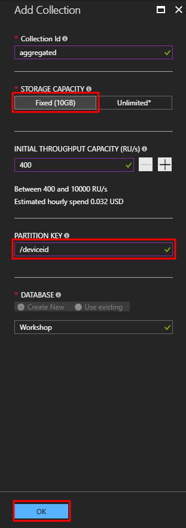
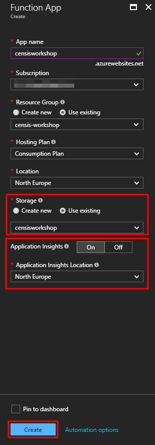

# Processing IoT Data - Hands On Lab

## Contents

1. [Objectives and Requirements](#objectives-and-requirements)
    1. [Objectives](#objectives)
    1. [Requirements](#requirements)
1. [Instructions](#instructions)
   1. [Prerequisites](#prerequisites)
   1. [Using Stream Analytics to Store Aggregated Data](#using-stream-analytics-to-store-aggregated-data)
      1. [Create a Stream Analytics Job](#create-an-azure-stream-analytics-job)
      1. [Create The Job Input](#create-the-job-input)
      1. [Add The Archive Output](#add-the-archive-output)
      1. [Add A Query](#add-a-query)
      1. [View the Archived Data](#view-the-archived-data)
   1. [Using Stream Analytics to Store Aggregated Data](#using-stream-analytics-to-store-aggregated-data)
      1. [Create a CosmosDB Account](#create-a-cosmosdb-account)
      1. [Add The Aggregated Data Output](#add-the-aggregated-data-output)
      1. [Amend The Query to Include Aggregated Data](#amend-the-query-for-aggregated-data-output)
      1. [View & Query the Aggregated Data](#view-and-query-aggregated-data)
   1. [Using Stream Analytics to Raise Events](#using-stream-analytics-to-raise-events)
      1. [Create an Azure Function](#create-an-azure-function)
      1. [Add The Azure Function Output to the Streaming Job](#add-the-azure-function-output-to-the-streaming-job)
      1. [Update the Query to Raise Events](#update-the-query-to-raise-events)
      1. [Test Event Processing](#test-event-processing)
   1. [Cleaning Up](#cleaning-up)

## Objectives and Requirements

### Objectives

1. Use [Azure Stream Analytics](https://azure.microsoft.com/en-gb/services/stream-analytics/) to process data from Azure IoT Hub
1. Output processed data from Stream Analytics to:
   1. [Azure Table Storage](https://azure.microsoft.com/en-gb/services/storage/tables/) to archive data
   1. [Azure CosmosDB](https://azure.microsoft.com/en-gb/services/cosmos-db/) to store aggregated data
   1. An [Azure Function](https://azure.microsoft.com/en-gb/services/functions/) to send alerts

### Requirements

1. Microsoft Visual Studio Community, Professional or Enterprise 2017 (Windows 10)
1. Access to an Azure Subscription with Administrator permissions
1. Azure Resource Group with an Azure IoT Hub (provisioned in the previous HOL)

---

## Instructions

### Prerequisites

Activities in this lab take place within the Azure Portal using the resource group created in the previous lab.

1. Navigate to the [Azure Portal](https://portal.azure.com)
1. Select "Resource Groups" from the menu on the left

   
1. Select the `censis-workshop` resource group you created in the previous Hands On Lab

### Using Stream Analytics to Archive Data

#### Create an Azure Stream Analytics Job

We will create an Azure Stream Analytics Job which will be used to perform aggregations on the data as well as storing data in an archive.

1. In the `censis-workshop` Resource Group blade, select add in the top left

   
1. In the search box type "Azure Stream Analytics" and select the suggestion

   
1. Select `Stream Analytics job` from the results and click `Create`

   
1. In the `New Stream Analytics job` blade, fill in the values as follows (selecting your subscription where relevant) and click `Create`:

   
1. When the deployment completes, select `Go to resource` in the notification

   

You should now see the following:


#### Create The Job Input

The streaming job will take input from the IoT Hub created in the previous lab.

1. Under `Job Topology` select `Inputs`

   
1. In the inputs blade, select Add and populate the fields as follows and click `Create`

   
1. Click the cross in the input blade to go back to the streaming job overview

#### Add The Archive output

The first output will be for an archive of raw data received from the device.

1. Under `Job Topology` select `Outputs`

   
1. In the Outputs Blade, select Add and populate the fields as follows and click `Create`, selecting the storage account you created in the previous Hands On Lab as the `Storage account` option

   
   1. For copy-paste convenience, the Partition Key is `deviceId` and the Row Key is `EventEnqueuedUtcTime`
1. Click the cross in the output blade to go back to the streaming job overview

#### Add A Query

1. Under `Job Topology` select `Query`

   
1. You should see the following Query Blade:

   
1. Replace the Query Text with the following and click `Save` confirming the changes when prompted:
   ```sql
    SELECT
        *
    INTO
        [archive]
    FROM
        [iot-hub] TIMESTAMP BY EventEnqueuedUtcTime
   ```
1. Click the cross in the query blade to go back to the streaming job overview
1. Click `Start` in the Stream Analytics Job overview blade
1. Select `Now` when prompted then click `Start`

   
1. Start the device simulator and send some messages to the IoT Hub

#### View the Archived Data

1. Open Azure Storage Explorer and connect to your subscription ([see the Microsoft Documentation for instructions](https://docs.microsoft.com/en-us/azure/vs-azure-tools-storage-manage-with-storage-explorer))
1. Find the Storage Account you created in the previous Hands On Lab, expand the tables node, find the `archive` table and double click to open and view the archived data

### Using Stream Analytics to Store Aggregated Data

#### Create a CosmosDB Account

Aggregated data will be stored in Azure CosmosDB using the DocumentDB API.

1. In the `censis-workshop` Resource Group blade, select add in the top left

   
1. In the search box type "Cosmos DB" and select the suggestion

   
1. Select `Azure Cosmos DB` and click `Create`

   
1. In the `New Account` Blade, enter the values as follows. The `ID` must be globally unique across all Cosmos DB Accounts (you can use the same value used for the IoT Hub Name) and ensure `SQL (document)` is selected as the API

   
1. When the deployment completes, click `Go To Resource` in the notification

   
1. In the Azure Cosmos DB Account, select `Add Collection`

   
1. Set up the collection as follows and click `OK`:

   
   > **NOTE**: The partition key value **must** be all lower case.
1. Click the cross on the `Azure Cosmos DB Account` Blade to return to the Resource Group Blade

#### Add The Aggregated Data Output

1. Go back to your Stream Analytics Job
1. If the job is `Running`, click `Stop` and wait until the job stops

   
1. Under `Job Topology` select `Outputs`

   
1. In the Outputs Blade, select Add and populate the fields as follows and click `Create`, selecting the Cosmos DB

   
   > **NOTE** The highlighted values must match the value `aggregated` exactly.

#### Amend The Query For Aggregated Data Output

1. Under `Job Topology`, select `Query`

   
1. Add the following query __after__ the existing query:
   ```sql
   SELECT
        AVG(temperature) AS avtemp,
        AVG(humidity) AS avhumidity,
        System.Timestamp AS endofwindow,
        deviceId
    INTO
        aggregated
    FROM
        [iot-hub] TIMESTAMP BY EventEnqueuedUtcTime
    GROUP BY deviceId, TUMBLINGWINDOW(s, 30)
   ```
   >**Note: If you modified the message payload, swap temperature and humidity for the scalar numeric values your are sending instead.**
1. Click `Save` and click `Yes` when prompted

   
1. Click the cross in the query blade to go back to the streaming job overview
1. Click `Start` in the Stream Analytics Job overview blade
1. Select `Now` when prompted then click `Start`

   
1. Close the Stream Analytics job blade to return to the Resource Group blade
1. Start the device simulator and send some messages to the IoT Hub

#### View and Query Aggregated Data

1. In the list of resources, select the Cosmos DB account you created earlier
1. In the `Collections` list, select the `aggregated` collection

   
1. You should see a UI that looks like this:

    
1. Select one of the documents in the list to see the output generated from the streaming job
1. Click the `Edit Filter` button to add a condition to the query filter and enter the following in the field:
    ```sql
    where c.avtemp < 27
    ```
    > **NOTE** You may need to modify the value to see results, depending upon the values sent from your simulator. If you modified the payload and the Stream Analytics Query accordingly, use the property name from your query instead of `avtemp`.
1. Click `Apply Filter` and you will see the list of documents filtered to those matching the query very quickly

   
1. Spend some time playing with the query. All properties are indexed by default, so queries should always be optimised
1. When you are finished, click the cross in the `Azure Cosmos DB Account` blade to return to the resource group blade

### Using Stream Analytics to Raise Events

The message payload that is being sent to the Azure IoT Hub contains a digital (on/off. true/false) value. We will use this to raise events from Stream Analytics to alert on a change of state on the monitored equipment. Events will then be processed by an Azure Function.

#### Create an Azure Function

1. In the `censis-workshop` Resource Group blade, select add in the top left

   
1. In the search box type "function app" and select the suggestion (Function App)

   
1. Select `Function App` and click `Create`

   
1. In the `Function App Create` Blade, enter the values as follows. The App name must be globally unique across all Azure App Services (you can use the same value used for the IoT Hub Name). For the storage option, use the same storage account you created in the previous lab and ensure `Application Insights` is on with `North Europe` selected as the location. Click `Create` when ready

   
1. Close the `Function App` and `Everything` blades to return to the resource group blade
1. When the deployment succeeds, click `Go to resource` on the notification

   
1. You should now see the Azure Functions UI, click the `+` button next to `Functions`

   
1. Ensure `Webhook + API` and `CSharp` are selected and click `Create this function`

   
1. You should then see the Function Editor. Replace all the code with the following (replacing `you@yourdomain.com` with your own email address) and click `Save`:

    ```csharp
    #r "SendGrid"
    #r "Newtonsoft.Json"

    using System.Net;
    using SendGrid.Helpers.Mail;
    using Newtonsoft.Json;

    public static async Task<HttpResponseMessage> Run(HttpRequestMessage req, IAsyncCollector<Mail> mailOutput, TraceWriter log)
    {
        try
        {
            var events = await req.Content.ReadAsAsync<StateChangedEvent[]>();

            foreach(var e in events)
            {
                var mail = new Mail{
                        Subject = $"{e.DeviceId} State Changed Event"
                    };
                var personalization = new Personalization();
                personalization.AddTo(new Email("you@yourdomain.com"));

                var content = new Content{
                    Type = "text/plain",
                Value = $"A State Changed event was detected for Device ID {e.DeviceId}. The new status is {e.Status}. The change took place at {e.EventTime} and was processed at {e.EventProcessedTime}."
                };
                mail.AddPersonalization(personalization);
                mail.AddContent(content);
                await mailOutput.AddAsync(mail);
            }
        }
        catch(Exception ex){
            log.Error("Failed to process events", ex);
            return req.CreateErrorResponse(HttpStatusCode.InternalServerError, ex);
        }
        return req.CreateResponse(HttpStatusCode.Accepted);
    }

    internal class StateChangedEvent{
        [JsonProperty("deviceid")]
        public string DeviceId {get;set;}
        [JsonProperty("status")]
        public string Status {get;set;}
        [JsonProperty("eventtime")]
        public string EventTime {get;set;}
        [JsonProperty("eventprocessedtime")]
        public string EventProcessedTime {get;set;}
    }
    ```
1. On the right hand side, select `View files`

   
1. Select `function.json` in the file list

   
1. Replace the `json` content with the following (replacing `noreply@yourdomain.com` with a value of your choice):

   ```javascript
   {
    "disabled": false,
    "bindings": [
            {
                "authLevel": "function",
                "name": "req",
                "type": "httpTrigger",
                "direction": "in"
            },
            {
                "name": "mailOutput",
                "type": "sendGrid",
                "direction": "out",
                "apiKey" : "sgKey",
                "from": "noreply@yourdomain.com"
            },
            {
                "name": "$return",
                "type": "http",
                "direction": "out"
            }
        ]
    }
   ```
1. Click `Save`
1. Navigate to the root of the function app

   
1. Select `Application settings`

   
1. Under `Application settings` click `Add new setting` with the key `sgKey` and the value supplied via email then click save

   

#### Add The Azure Function Output to the Streaming Job

1. In the resource list, select the Stream Analytics Job you created earlier in this lab
1. Under `Job Topology` select `Outputs`

   
1. In the Outputs Blade, select Add and populate the fields as follows, selecting the function app you just created and `HttpTriggerCSharp1` and click `Create`

   
1. The output will be tested, and should succeed

#### Update the Query to Raise Events

1. Under `Job Topology`, select `Query`

   
1. Add the following **after** the two existing queries:

   ```sql
   SELECT
       deviceId,
       CASE WHEN motorActive = 1 THEN 'Running' ELSE 'Stopped' END AS Status,
       System.Timestamp as EventProcessedTime,
       EventEnqueuedUtcTime AS EventTime
   INTO
       [alerts]
   FROM
       [iot-hub] TIMESTAMP BY EventEnqueuedUtcTime
   WHERE
       motorActive <> LAG(motorActive, 1) OVER (PARTITION BY deviceId LIMIT DURATION(minute, 10) WHEN motorActive IS NOT NULL) AND
       LAG(motorActive, 1) OVER (PARTITION BY deviceId LIMIT DURATION(minute, 10) WHEN motorActive IS NOT NULL) IS NOT NULL
   ```
1. Click Save then click the cross on the `Query` blade to return to the job overview.

   
1. Click `Start` to start the streaming job as in the previous sections.

#### Test Event Processing

1. Return to the device simulator and send some events to the IoT Hub
1. Close the Device Simulator App and find the following method in `Program.cs`:

   ```csharp
    private static string ConstructDataSample(int count)
    {
        var rnd = new Random();
        double temperature;
        double humidity;
        temperature = rnd.Next(20, 35);
        humidity = rnd.Next(60, 80);
        var dataBuffer = $"{{\"deviceId\":\"{deviceId}\",\"messageId\":{count},\"temperature\":{temperature},\"humidity\":{humidity}, \"motorActive\":true}}";
        return dataBuffer;
    }
   ```
1. Change `\"motorActive\":true` to `\"motorActive\":false`
1. Start the device simulator again and send some more events.
1. You should then receive an email with an alert about the change in state.

### Cleaning Up

The final part of the workshop is to clean up all the resources you created. While resources are running, you are incurring cost. Some resources cannot be stopped, so deleting them is the only way to stop paying for them. You can, if you wish, leave the resources in place if you want to come back to the workshop at a later date. If you want to delete the resources you created, follow these steps:

1. Close the Stream Analytics Job overview blade (if you still have it open) to return to the `censis-workshop` blade
1. Click `Delete resource group`

   
1. You will be prompted to enter the name of the resource group before confirming. Enter `censis-workshop` and click `Delete`

   

[END OF LAB 2]